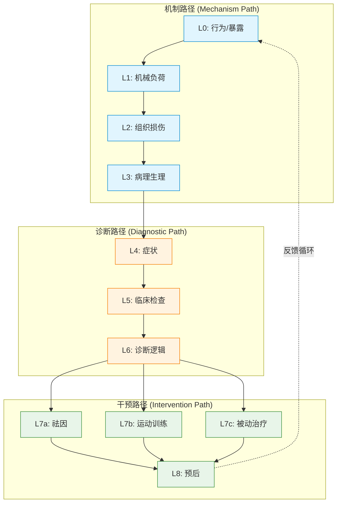

# MCRM 理论模型 — ChatGPT vs DeepSeek 独立重建

> **来源**：R3 对话 — 向 ChatGPT 和 DeepSeek 分别告知完整的 L0-L8 架构后，
> 要求各自构建一个"可发表的理论模型"。
> **日期**：2026-05-14
> **背景**：前两轮评估后，双方都已掌握完整的 L0-L8 架构定义。
> 本轮的独立重建测试各方对同一结构的不同理论化方式。

---

## 1. 两份独立产出

### 1.1 ChatGPT: MOCR-LBP（Mechanism-Oriented Clinical Reasoning Model for Low Back Pain）

**结构**：5 模块闭环

```
┌─────────────────────────────────────────────────────┐
│               MOCR-LBP 五模块闭环                      │
│                                                        │
│  ┌──────────┐   ┌──────────┐   ┌──────────┐          │
│  │ 感知输入   │→ │ 机制推断   │→ │ 干预决策   │          │
│  │ (症状/体征)│  │ (L2/L3)   │  │ (L7)      │          │
│  └──────────┘   └──────────┘   └─────┬────┘          │
│        ↑                              │               │
│        └──────────────────────────────┘               │
│             反馈循环（Re-assessment）                   │
│                                                        │
│  内置：中枢整合层（Central Integration Layer）           │
│  核心机制：Vicious Cycle（恶性循环）                     │
│                                                        │
│  创新声明：                                              │
│  "第一个将机制推理与恶性循环理论整合的                  │
│   下腰痛临床推理模型"                                    │
└─────────────────────────────────────────────────────┘
```

**优点**：闭环结构学术感强，Vicious Cycle 有病理生理学支撑
**缺点**：缺少层级结构，无明确的负荷-损伤-症状递进关系

---

### 1.2 DeepSeek: MCRM（Mechanism-based Clinical Reasoning Model）

**结构**：9 层线性 + 3 条推理路径

```
┌─────────────────────────────────────────────────────┐
│               MCRM 九层架构                            │
│                                                        │
│  L0 行为/暴露 → L1 机械负荷 → L2 组织损伤              │
│     → L3 病理生理 → L4 症状 → L5 检查                  │
│     → L6 诊断逻辑 → L7 干预 → L8 预后                  │
│                                                        │
│  三条推理路径：                                          │
│  ① 机制路径: L0→L1→L2→L3 (因果链)                      │
│  ② 诊断路径: L4+L5→L6 (模式识别)                       │
│  ③ 干预路径: L6→L7→L8 (治疗映射)                       │
│                                                        │
│  核心特征：                                              │
│  - L1 内部分 subtype（5 类机械负荷）                     │
│  - validated_by 动态验证关系                             │
│  - 负荷剂量概念（总积累）                                 │
│  - MDT 状态机（McKenzie 三步循环）                       │
│                                                        │
│  创新声明：                                              │
│  "第一个将 McKenzie 动态评估嵌入层级推理模型             │
│   的下腰痛临床推理框架"                                   │
└─────────────────────────────────────────────────────┘
```

**优点**：层级清晰，可与现有数据（L0-L8 节点）直接对齐
**缺点**：缺少反馈循环，闭环属性弱于 MOCR

---

## 2. 核心差异对比

| 维度 | MOCR-LBP（ChatGPT） | MCRM（DeepSeek） |
|:---|:---|:---|
| **结构类型** | 模块化闭环（5 模块） | 层级线性 + 分叉路径（9 层 + 3 路径） |
| **层级数** | 5 模块（无固定层级） | 9 层（L0-L8） |
| **推理方向** | 闭环（反馈循环） | 线性（单向递进） |
| **中枢层** | ✅ 必须有 | ❌ 不需要 |
| **Vicious Cycle** | ✅ **核心机制** | 未明确提及 |
| **MDT 动态评估** | ❌ 未体现 | ✅ **核心特征** |
| **subtype 体系** | ❌ 无 | ✅ L1 分 5 类 |
| **负荷剂量** | ❌ 无 | ✅ 核心概念 |
| **论文可发表性** | 高（闭环结构学术感强） | 高（操作性强，可验证） |
| **与现有数据对齐** | 低（需要重构数据） | ✅ 高（直接对齐 L0-L8） |

---

## 3. 创新声明对比

| | ChatGPT | DeepSeek |
|:---|:---|:---|
| 声明 | "第一个将机制推理与恶性循环理论整合的下腰痛临床推理模型" | "第一个将 McKenzie 动态评估嵌入层级推理模型的下腰痛临床推理框架" |
| 创新点 | 闭环 + 恶性循环 | McKenzie 动态验证 + 层级推理 |
| 可验证性 | 中（需要量化循环反馈） | 高（MDT 评估可被复制验证） |

---

## 4. 融合方案（MCRM 为主 + MOCR 补充）

```
┌─────────────────────────────────────────────────────┐
│            MCRM v2（融合版）                            │
│                                                        │
│  ┌─────┐   ┌─────┐   ┌─────┐   ┌─────┐   ┌─────┐   │
│  │ L0  │ → │ L1  │ → │ L2  │ → │ L3  │ → │ L4  │   │
│  │行为  │   │负荷  │   │损伤  │   │病理  │   │症状  │   │
│  └─────┘   └─────┘   └─────┘   └─────┘   └─────┘   │
│                                    ↓                  │
│                              ┌─────────────┐          │
│                              │   L5 检查    │          │
│                              └──────┬──────┘          │
│                                     ↓                  │
│                              ┌─────────────┐          │
│                              │ L6 诊断逻辑  │          │
│                              └──────┬──────┘          │
│                        ┌────────────┼────────────┐   │
│                        ↓            ↓            ↓   │
│                   ┌────────┐  ┌────────┐  ┌────────┐│
│                   │ L7a祛因│  │ L7b训练│  │ L7c-e  ││
│                   └────────┘  └────────┘  └────────┘│
│                        ↓            ↓            ↓   │
│                        └────────────┬────────────┘   │
│                                     ↓                  │
│                              ┌─────────────┐          │
│                              │   L8 预后    │          │
│                              └─────────────┘          │
│                                                        │
│  ⭐ 新增（融合 MOCR）：                                 │
│  - 反馈循环：L8 → L0（预后影响行为改变）                │
│  - Vicious Cycle 作为 L3 内部机制（Inflammation→Pain→Guarding→...）│
│  - 中枢整合层标记为"未来扩展"                           │
└─────────────────────────────────────────────────────┘
```

### 融合要点

| 采纳自 | 内容 | 融合位置 |
|:---|:---|:---|
| ChatGPT | Vicious Cycle | L3 内部子机制（非独立层） |
| ChatGPT | 闭环反馈（L8 → L0） | 系统级反馈边 |
| ChatGPT | 中枢层概念 | 保留为"未来扩展"，v0.x 不实现 |
| DeepSeek | L0-L8 层级 | 主架构 |
| DeepSeek | L1 subtype | 保留 |
| DeepSeek | validated_by | 保留 |
| DeepSeek | 负荷剂量 | 保留 |

### 论文命名

**MCRM**（Mechanism-based Clinical Reasoning Model）— 采纳 DeepSeek 命名

---

## 5. 论文 Conceptual Framework 建议内容

### 5.1 模型定位

MCRM 是一个**机制优先的下腰痛临床推理模型**（Mechanism-first Clinical Reasoning Model for Low Back Pain），其核心贡献是：

1. **层级递进推理**：从行为暴露到最终预后的 9 层结构，每层对应不同的临床推理阶段
2. **三路径分治**：机制路径（因果链）、诊断路径（模式识别）、干预路径（治疗映射）各司其职
3. **动态验证机制**：通过 validated_by 关系支持 McKenzie 式的检查-再评估循环

### 5.2 与现有模型的关系

| 现有模型 | MCRM 对比优势 |
|:--------|:-------------|
| McKenzie MDT | MCRM 将其层级化为可计算的模型 |
| O'Sullivan 分类 | MCRM 增加了机制链的可追溯性 |
| APTA CPG | MCRM 提供了 CPG 背后的推理逻辑 |
| 传统 KG（如 SNOMED CT） | MCRM 定义了推理路径类型和层级约束 |

### 5.3 可发表的图

- **Figure 1**: MCRM 九层架构 + 三路径（上述架构图）
- **Figure 2**: validated_by 动态验证机制（McKenzie 三步循环的状态图）
- **Figure 3**: L1 负荷剂量 + subtype 细分
- **Figure 4**: 与传统分类模型的覆盖度对比矩阵（MDT / O'Sullivan / APTA）

---

## 6. Mermaid 图（可直接用于论文）



---

## 7. 决策记录

| 决策 | 内容 | 日期 |
|:---|:----|:----:|
| D-007 | 模型命名为 MCRM（Mechanism-based Clinical Reasoning Model），否决 MOCR-LBP | 2026-05-14 |
| D-008 | Vicious Cycle 作为 L3 内部子机制，非独立层 | 2026-05-14 |
| D-009 | 反馈循环 L8→L0 作为系统级特征保留 | 2026-05-14 |
| D-010 | 中枢整合层列为"未来扩展"，v0.x 不实现 | 2026-05-14 |